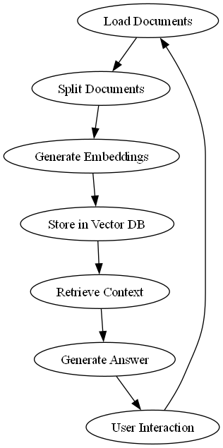

# LLM-Powered PDF/CSV QA System

## 🚀 Overview

This project implements a **Retrieval-Augmented Generation (RAG)** system powered by a Local Large Language Model (LLM) using **Ollama**. It allows users to:

- Ingest **PDF and CSV** documents.
- Ask **questions strictly based on uploaded documents**.
- Gracefully decline to answer **out-of-scope queries**.
- Handle **multi-document reasoning** (e.g., combining CSV and PDF content).

> Built using **LangChain**, **LangGraph**, **FAISS**, and **Streamlit** for an interactive frontend.

---

## 📦 Features

- ✅ PDF/CSV ingestion & parsing
- ✅ Text chunking and semantic embedding
- ✅ Vector similarity search using FAISS
- ✅ Local LLM-powered question answering via Ollama
- ✅ Agentic RAG flow using LangGraph
- ✅ Streamlit-based chat interface
- ✅ Handles unanswerable questions gracefully

---

## 🛠️ Installation

### 🔧 Prerequisites
- Python 3.8+
- [Ollama](https://ollama.com/) installed and running (e.g., `ollama run mistral`)

### 🔁 Steps

```bash
# 1. Clone the repository
$ git clone <your-repo-url>
$ cd your-project-folder

# 2. Create a virtual environment
$ python -m venv venv

# 3. Activate the virtual environment
# On Windows:
$ venv\Scripts\activate
# On macOS/Linux:
$ source venv/bin/activate

# 4. Install dependencies
$ pip install -r requirements.txt
```

---

## 🚀 Running the App

### 🧪 Option 1: Terminal Mode (CLI)
```bash
python scripts/main.py
```
- Place files inside `data/` folder.
- You'll be prompted to enter your question.

### 🌐 Option 2: Streamlit Web App
```bash
streamlit run app.py
```
- Upload your PDF and/or CSV files.
- Ask questions in the input box.
- View answers based on the file contents.

> ⚠️ Ensure Ollama is running in background: `ollama run mistral`

---

## 🗂️ Project Structure

```
project_root/
├── app.py                    # Streamlit web app interface
├── requirements.txt          # All Python dependencies
├── README.md                 # Project documentation
│
├── data/                     # Input documents
│   ├── sales_data.csv
│   └── sample_report.pdf
│
├── vector_index/            # Stores FAISS vector index
│
├── scripts/                 # Main pipeline script
│   └── main.py
│
├── src/                     # Modular component code
│   ├── document_processing/
│   │   ├── loaders.py        # Loads PDF and CSV content
│   │   └── splitters.py      # Chunks the loaded text
│   ├── embeddings/
│   │   └── faiss_store.py    # Embedding and FAISS logic
│   └── llm/
│       └── ollama_integration.py # LLM logic using Ollama
│
├── tests/                   # Unit tests for each module
│   ├── test_loaders.py
│   ├── test_splitters.py
│   ├── test_faiss_store.py
│   └── test_ollama.py
|__ evaluation.py           
```

---

## 📊 Workflow Diagram

Below is the workflow diagram of the system:



---

## 📊 Sample Data and Example Questions

### ✅ Sample CSV (`data/sales_data.csv`):
```csv
Date,Product,Region,Units Sold,Revenue
2025-01-05,UltraWidget 3000,North America,150,45000
2025-01-06,MegaWidget 2000,Europe,80,16000
2025-01-07,UltraWidget 3000,Asia,200,60000
2025-01-08,MegaWidget 2000,North America,120,24000
```

### 📄 Sample PDF (`data/sample_report.pdf`):
> Contains a product overview, strategic plans for 2025, and region-specific goals.

### 💡 Sample Questions
- What is the total revenue for UltraWidget 3000?
- How many units of MegaWidget 2000 were sold in Europe?
- What is the strategy for expanding in Asia?
- What was the revenue on 2025-01-05?

### ❌ Out-of-Scope Questions (System should gracefully decline):
- Who is the CEO of Tesla?
- What is the capital of Germany?

---

## 🧪 Run Tests
```bash
pytest tests/
```

---

## 🧠 Acknowledgements
- [LangChain](https://github.com/hwchase17/langchain)
- [LangGraph](https://github.com/langchain-ai/langgraph)
- [FAISS by Facebook Research](https://github.com/facebookresearch/faiss)
- [Ollama](https://ollama.com)

---

## 📜 License
MIT License

---

Need help setting it up or customizing it for a specific use-case? Let me know and I’ll guide you!
